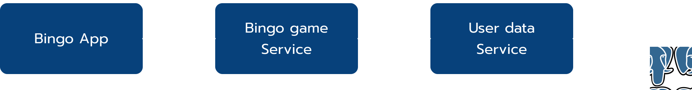
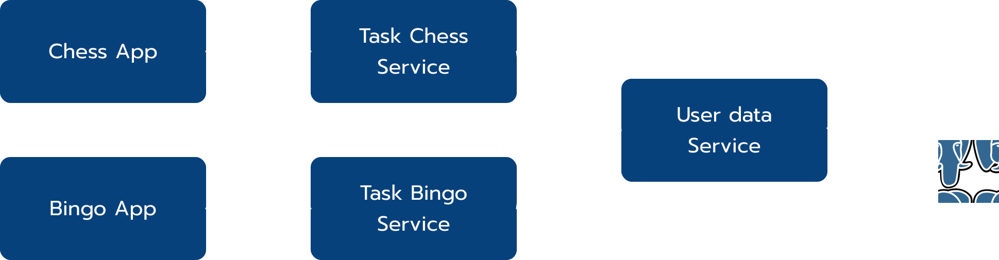
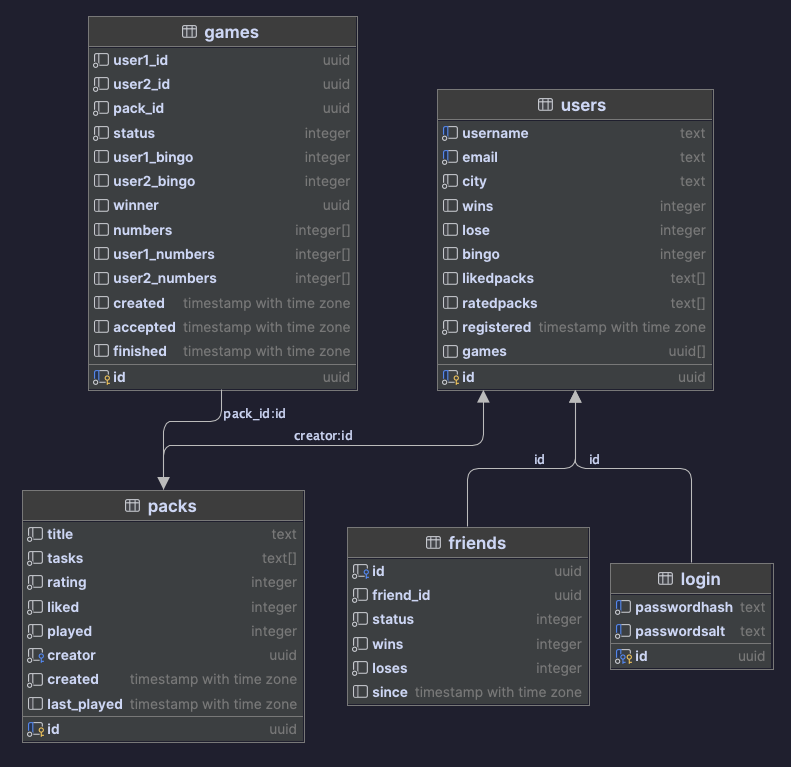

> ***Warning!*** This project was made for educational purposes. Now in beta

## Idea

Two players agree upon a list of 16 tasks, which forms a 'pack'. 
Once a pack is set, the game commences. Players input the tasks they've completed, and these populate a 4x4 field. 

But here's the twist: tasks are scattered randomly across the field, introducing a delightful element of luck. 
The objective? Secure as many '4 in a row' combinations as possible. 

<h3 style='color: #7dffc6;'>the odds are always in your favour</h3>

## The Story

In the throes of Covid lockdowns, when days melded into nights, my productivity levels were so low, 
they would make a sloth look like an overachiever. But then, amidst the haze of takeout containers 
and unwashed laundry, the concept of Task Bingo took its first breath.

Frankly, our initial version wasn't winning any beauty contests. It was a scrappy mess hastily pieced together. 
The graphics? Primitive. The UX? Don’t even ask. But it worked, and that's what mattered.

As quarantine faded, our lives began to resume some semblance of normality. 
Energized, productive, and even a tad athletic, we drifted away from our creation. 
The Task Bingo files were cast aside, lost in the chaos of other fleeting aspirations.

But more on that story [here](https://taskbingo.com/about);)

## Architecture

Architecture is quite simple:

The microservice thing was done to scale the productivity core thing with other mini-games like chess or poker later:

## Backend

Backend consists of two microservices: 
 - **Game service** is the main service, the 'heart' of the game, 
 - **User service** is the service that is responsible for processing and storing user data

For now postgres ERD looks like this:

## Technical Goals

### #1 Use SvelteKit

For the frontend, I chose `SvelteKit`. I tried `React` some time ago but wanted to try `Svelte` as it is making a lot of noise nowadays.
This was a great decision and I learned a lot.

But at the end of a day `SvelteKit` is a tool that gets the job done. A great tool I would say, but I'm not a frontend developer and I
haven't seen much. It was my first frontend app (yeah I made something tiny with `React.js`, but that was nothing in comparison) and
somehow I managed to enjoy it when I finally understood the framework enough to finish the project.

### #2 Deploy

Of course this project needed to be deployed! I wanted to help people, so I needed to make it accessible.

Frontend and backend are deployed on `Ubuntu` server. Frontend and backend are managed by `docker`.
All routing is made with `nginx`, so the website is accessible at *taskbingo.com* and to access backend it goes *taskbingo.com/api*.

Backend is deployed using `Github Actions`. It automatically builds docker images, pushes them to container registry and deploys with docker-compose. 

Finally, postgres instance is deployed on other server. I thought it would be nice to have two instances with 
master-master replication and other cool stuff, but I think it's too much for this project.

### #3 Master Go

Last but not least!. `Go` is just a language, just a tool, and I try to think pragmatically, but I'm completely in love with it.
Working with `Go` feels very natural to me, I like how the language is forcing you to write better, more readable and understandable code.

### Conclusion

In conclusion, I understood a quite simple thing: tools don't mean much, they are just needed to make a product that will help someone (or yourself).
