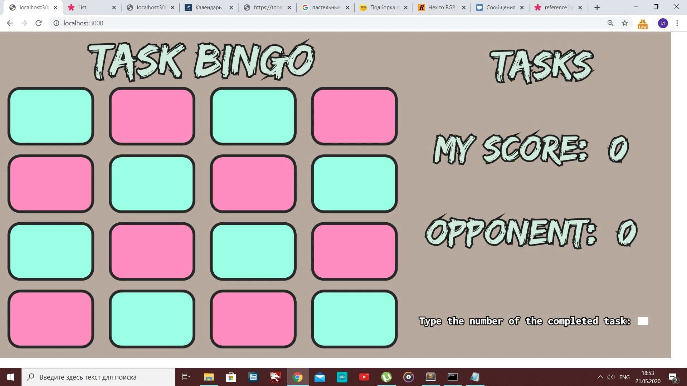
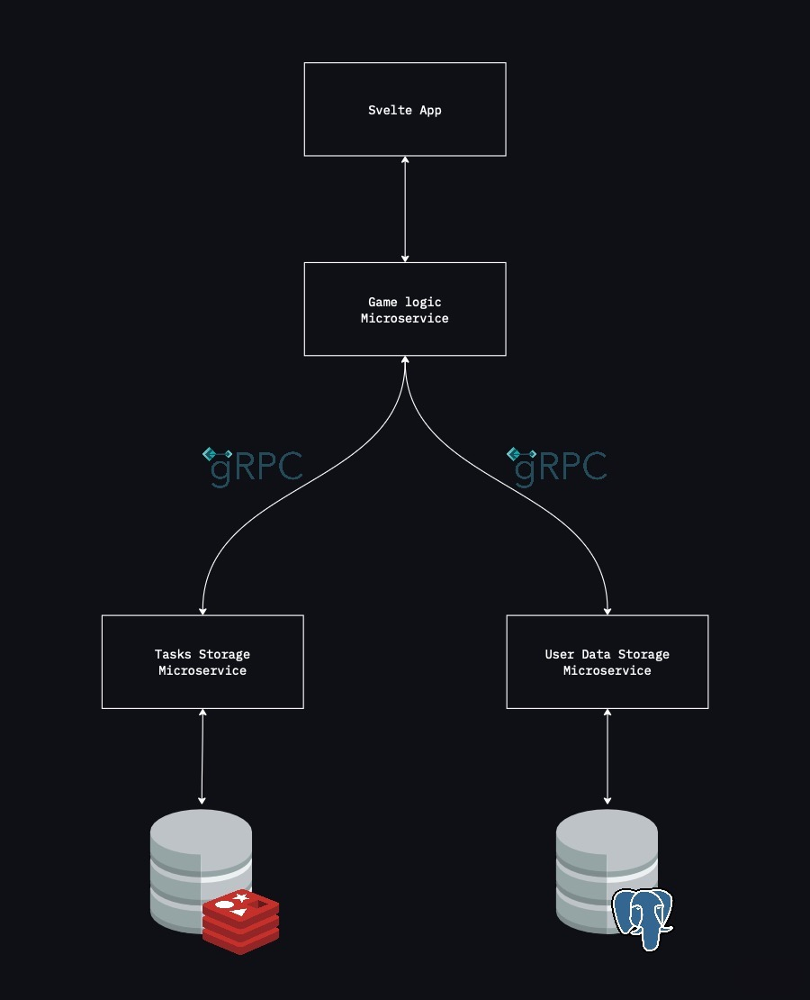
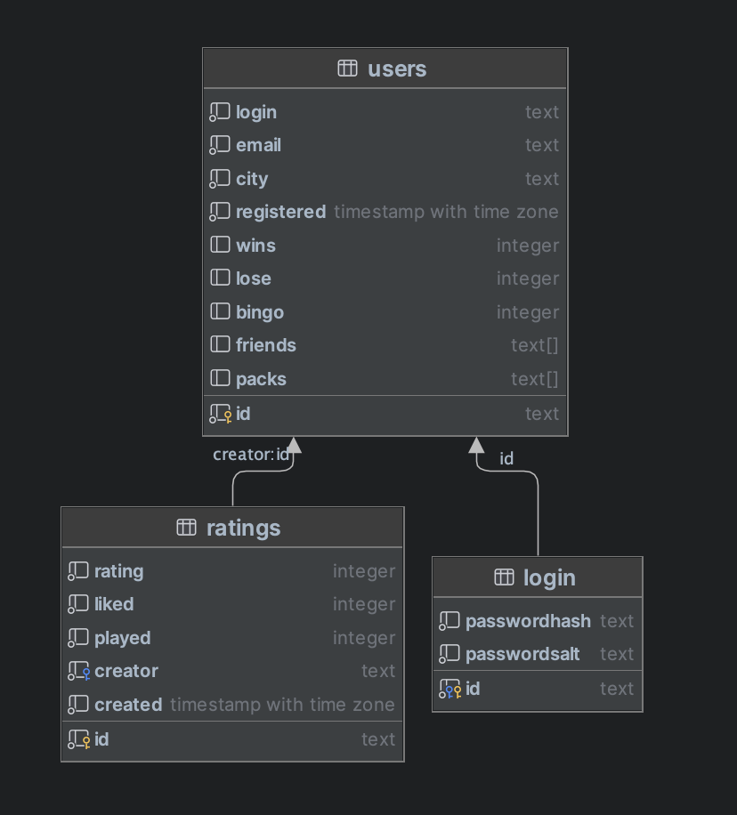

# Task Bingo

> ***Note for Tinkoff Start***
> 
> Уважаемая команда Тинькофф Старт, данная заметка специально для вас.  
> 
> Да, в анкете я указал что данный проект уже закончен, но лишь потому что знал, 
> что смотреть работы вы будете с 22 января по 2 марта. 
> В тот же момент решил, до 22 января я доделаю проект, но если вдруг вы смотрите на проект чуть 
> раньше 22 января или оно уже наступило, а заметка все еще тут, то я прошу прощения за свою оплошность.
> 
> В целом, большая часть проекта уже готова, однако не готова важная часть - механизм создания и проведения игры. 
> На данный момент для реализации этой части готово все:
> * Регистрация и вход
> * Создания пака заданий и добавление его в избранное
> * Добавление друзей через запрос на дружбу
> * а также другие маленькие, но немаловажные детали
> 
> Я понимаю, что дело не только в проекте, но и в тесте, навыках в целом и в остальных критериях.
> 
> А закончу тем, что я очень хочу попасть к вам на стажировку! Спасибо за внимание;)

> ***Warning!*** This project was made for educational purposes. I would not use this architecture in production.

> ***Warning#2!*** Version 1.0 is not released yet. 
> 
> Some things may change before the release. Some things are still in development.

## Idea

This is not an average bingo game. It's task bingo.

The concept is to think of 16 tasks you would like to accomplish every day to grow your productivity, and then
at the end of the day, you will fill the table with task numbers you've done to see if you earned any bingo.

## The Story

A friend of mine came up with this idea in early June'20 when covid lockdowns happened, and our productivity decreased. 
We wanted to solve this problem, so we made a list of 16 tasks we wanted to accomplish every day, and he made an app 
using p5.js and ngrok. It looked kinda quirky: 

At the end of the lockdown, I lost the game, but we figured out how to work at home, stay productive and not go insane.

A lot has changed since then, and I still want to beat him but not in the game, but in app creation, as you maybe noticed. 
I wanted to do it in late May'22 with React.js [(you can check it here)](https://github.com/dupreehkuda/ReactiveBingo), 
but I understood it was not the right time for revenge.

But here it is, a SvelteKit app with a microservice backend written in Go and storage in Postgres and Redis 
live at [taskbingo.com](https://taskbingo.com)

## Architecture

As the warning said, this project was made for educational purposes, so there is 2 databases and three microservices.
I've already learned a lot, but that's not the end, and I would not use this architecture in production.

## Backend

Backend consists of three microservices: 
 - **Game service** is the main service, the 'heart' of the game, 
 - **User service** is the service that is responsible for processing and storing user data
 - **Task service** is the service that is responsible for processing and storing tasks packs

### Game service

Game service is a 'heart' of the game

I have implemented a three layer architecture: handler -> processor -> taskClient/userClient.
Processor is a layer of business-logic, so it manages requests to task service and user service.

This architecture allows us to change each part as we want, and it will work while each part implements specific
[interface](./game-service/internal/interfaces/interfaces.go).

taskClient and userClient is layers of gRPC connection to task and user services

This service has a middleware to check correctness of JWT-tokens that authorize users.

### User service

I have implemented a three layer architecture: handler -> processor -> storage. 
(processor is a layer of business-logic)

This architecture allows us to change each part as we want, and it will work while each part implements specific 
[interface](./user-data-service/internal/interfaces/interfaces.go).

Handlers is a layer where all gRPC handlers live.

Storage uses [jackc/pgx](https://github.com/jackc/pgx) as a driver and as an interface for accessing Postgres.
For now ERD looks like this:

### Task service

Just like **user service** I have implemented a three layer architecture: handler -> processor -> storage. 
(processor is a layer of business-logic)

This architecture allows us to change each part as we want, and it will work while each part implements specific 
[interface](./task-data-service/internal/interfaces/interfaces.go).

Handlers is a layer where all `gRPC` handlers live.

Storage uses [go-redis](https://github.com/go-redis/redis) and [go-rejson](https://github.com/nitishm/go-rejson) libraries, 
because Redis storage has a RedisJSON module, so it stores JSON values.

## Technical Goals

### #1 Use Redis

Try `Redis` is not actually #1 goal, but I need it before explaining next goals.

This goal is about `Redis`, not any key-value database. It is about `Redis` because a lot of companies use it for
cache, messages, sessions, some use it as a broker and so on. So I wanted to work with it for a little to have some experience.

Education is the only reason why I used it in this project.
It forced me to make third microservice, use gRPC more and deploy it on a separate VDS and configure `ReJSON` module.

Actually this decision to use two databases taught me a lot, because this was a very bad decision,
but now it's time to explain the next goal.

### #2 Use Microservice Architecture

First of all it's important to say that this project is not so complicated and should be done as a monolith. Why?
Because at least we don't need Redis and its microservice. Here Redis stores data, that's not needed in quick access
and can be easily stored in Postgres.

Secondly, the logic of main microservice is not so hard, so one package that calls `Postgres` can replace microservice that manages `Postgres`.
So this project will be actually better and cleaner if there were no microservices and no `Redis` at all.

### #3 Use SvelteKit

As for the frontend, I chose `SvelteKit`. I tried `React` some time ago but wanted to try `Svelte` as it is making a lot of noise nowadays.
This was a great decision and I learned a lot too.

But at the end of a day `SvelteKit` is a tool that gets the job done. A great tool I would say, but I'm not a frontend developer and I
haven't seen much. It was my first frontend app (yeah I made something tiny with `React.js`, but that was nothing in comparison) and
somehow I managed to enjoy it when I finally understood the framework enough to make the project.

### #4 Deploy

Of course this project needed to be deployed! I wanted to help people, so I needed to make it accessible.

Frontend and backend are deployed on `Ubuntu` Server. Frontend is managed by `pm2` app manager and backend runs in `docker` containers.
All routing is made with `nginx`, so the website is at *taskbingo.com* and to access backend it goes *taskbingo.com/api*.

Postgres is deployed on other server with the help of providers *managed service for Postgres*.
Provider did have a *managed service for Redis*, but I didn't use it because they don't let people on the insides of the system.
As I mentioned I needed `ReJSON`, but not plain `Redis`, so I got a separate `Debian` Server to configure and run `ReJSON` there.

### #5 Master Go

Last but not least!. `Go` is just a language, just a tool, and I try to think pragmatically, but I'm completely in love with it.
Working with `Go` feels very natural to me, I like how the language is forcing you to write better, more readable and understandable code.

### Conclusion

As the warning said, the architecture and excessive complexity are here for educational reason. And that's it.
The more I do, the more I understand that this is a huge mistake, but I believe I would never understand
how huge a mistake this is and why without making this project as I did.

This project could be done in much shorter amount of time if written in monolith and at least without `gRPC` and `Redis`.

In conclusion, I understood a quite simple thing: tools don't mean much, they are just needed to make a product that will help someone.