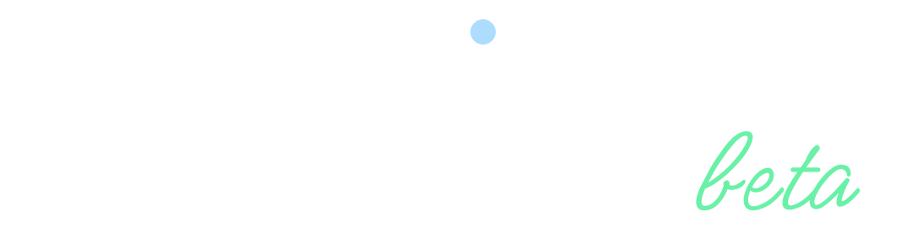

> ***Warning!*** This project was made for educational purposes.

> ***Warning#2!*** Version 1.0 is not released yet.

## Idea

This is not an average bingo game. It's task bingo.

The concept is to think of 16 tasks you would like to accomplish every day to grow your productivity, and then
at the end of the day, you will fill the table with task numbers you've done to see if you earned any bingo.

## The Story

A friend of mine came up with this idea in early June'20 when covid lockdowns happened, and our productivity decreased. 
We wanted to solve this problem, so we made a list of 16 tasks we wanted to accomplish every day, and he made an app 
using p5.js and ngrok. It looked kinda quirky: 

At the end of the lockdown, I lost the game, but we figured out how to work at home, stay productive and not go insane.

A lot has changed since then, and I still want to beat him but not in the game, but in app creation, as you maybe noticed. 
I wanted to do it in late May'22 with React.js [(you can check it here)](https://github.com/dupreehkuda/ReactiveBingo), 
but I understood it was not the right time for revenge.

But here it is, a SvelteKit app with a microservice backend written in Go and storage in Postgres and Redis 
live at [taskbingo.com](https://taskbingo.com)

## Architecture

Architecture is quite simple:

The microservice thing was done to scale the productivity core thing with other mini-games like chess or poker later:

## Backend

Backend consists of two microservices: 
 - **Game service** is the main service, the 'heart' of the game, 
 - **User service** is the service that is responsible for processing and storing user data

For now postgres ERD looks like this:

## Technical Goals

### #1 Use SvelteKit

For the frontend, I chose `SvelteKit`. I tried `React` some time ago but wanted to try `Svelte` as it is making a lot of noise nowadays.
This was a great decision and I learned a lot.

But at the end of a day `SvelteKit` is a tool that gets the job done. A great tool I would say, but I'm not a frontend developer and I
haven't seen much. It was my first frontend app (yeah I made something tiny with `React.js`, but that was nothing in comparison) and
somehow I managed to enjoy it when I finally understood the framework enough to finish the project.

### #2 Deploy

Of course this project needed to be deployed! I wanted to help people, so I needed to make it accessible.

Frontend and backend are deployed on `Ubuntu` server. Frontend is managed by `pm2` app manager and backend runs in `docker` containers.
All routing is made with `nginx`, so the website is at *taskbingo.com* and to access backend it goes *taskbingo.com/api*.

Backend is deployed using `Github Actions`. It automatically builds docker images, pushes them to container registry and deploys with docker-compose. 

Finally, postgres instance is deployed on other server. I thought it would be nice to have two instances with 
master-master replication and other cool stuff, but I think it's too much for this project.

### #3 Master Go

Last but not least!. `Go` is just a language, just a tool, and I try to think pragmatically, but I'm completely in love with it.
Working with `Go` feels very natural to me, I like how the language is forcing you to write better, more readable and understandable code.

### Conclusion

In conclusion, I understood a quite simple thing: tools don't mean much, they are just needed to make a product that will help someone.
