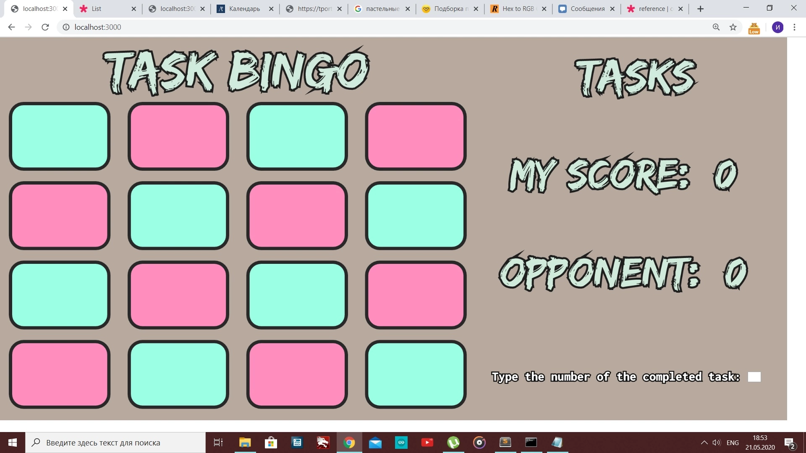

# Task Bingo

## Идея

Это не обычное бинго. Это бинго с заданиями.

Смысл в том, чтобы вместе с другом придумать 16 заданий, которые вы хотите выполнять каждый день. Эти задания могут
быть направлены на то, чтобы что-то выучить, не терять в чем то темп или просто быть продуктивными. Вечером же можно 
созвониться с другом и обсудить, что вы делали, к чему пришли и т.д., но в конце заполнить бинго, тем самым придав
рутине соревновательного духа.

## История

Эту идею придумал мой друг (ну ладно, переизобрел) в начале июня 2020 года, когда в Москве еще стояли ковидные ограничения.
Мы как одиннадцатиклассники сходили с ума - на носу ЕГЭ, поступление и т.д. и т.п., а продуктивность на нуле. 
В итоге мы быстро придумали 16 заданий, а он сделал веб-приложение с p5.js и ngrok. Выглядело конечно забавно:

К концу карантина я проиграл, но мы научились работать дома, оставаться подвижными и главное продуктивными, а также, 
что немаловажно, мы не сошли с ума. 

Многое поменялось с тех пор, однако все это время я придумывал план мести. Я не собирался выиграть его в игре, нет, 
надо было играть по-крупному и сделать приложение, и не только для нас двоих через ngrok, но и абсолютно для всех желающих!
Я попытался сделать это в Мае 2022 с React.js [(посмотреть набросок можно тут)](https://github.com/dupreehkuda/ReactiveBingo), 
но на тот момент было много дел, да и в целом надо было подтянуть навыки бэкенда.

Но вот оно свершилось, веб-приложение на SvelteKit с бэкендом на микросервисах на Go и хранением данных в Postgres и Redis
к вашим услугам - [taskbingo.com](https://taskbingo.com)

## Архитектура

Как уже объясняло предупреждение - это учебный проект. Я использую 2 разные базы данных и три микросервиса.
Я уже многому научился, однако пока что проект не закончен. Однако я уже знаю наверняка, что я никогда больше
не буду придумывать/использовать подобную архитектуру, но об этом ниже в целях и выводе.

Фронтенд общается с главным микросервисом, который отвечает за всю логику. Он в свою очередь по gRPC общается с двумя
другими микросервисами: один отвечает за данные в Redis, другой за Postgres.

## Backend

Итак, в бэкенде, как я уже сказал, три микросервиса:
- **Game service** - это главный микросервис, отвечающий за логику игры
- **User service** - сервис отвечающий за хранение данных пользователей
- **Task service** - сервис отвечающий за хранение наборов заданий

### Game service

**Game service** это сердце игры

Реализована трех-уровневая архитектура: `handler` -> `processor` -> `taskClient`/`userClient`.  
`Processor` - слой бизнес-логики, отвечает за логику и запросы к *task service* и *user service*

Архитектура позволяет заменять части, главное чтобы они подходили под нужный
[интерфейс](./game-service/internal/interfaces/interfaces.go), это снижает связность компонентов сервиса.

`taskClient` и `userClient` - слои подключения gRPC к соответствующим сервисам.

Так же присутствует middleware для проверки JWT-токенов, благодаря которым мы идентифицируем пользователя.

### User service

Реализована трех-уровневая архитектура: `handler` -> `processor` -> `storage`.  
Processor - слой бизнес-логики

Архитектура так же позволяет заменять части, главное чтобы они подходили под нужный
[интерфейс](./user-data-service/internal/interfaces/interfaces.go).

`Handlers` - слой где обитают все `gRPC` хэндлеры.
Слой `Storage` использует [jackc/pgx](https://github.com/jackc/pgx) и как драйвер и как интерфейс.
Пока что ERD выглядит так:

### Task service

Так же как у **user service** реализована трех-уровневая архитектура: `handler` -> `processor` -> `storage`.  
Processor - слой бизнес-логики 

Архитектура так же позволяет заменять части, главное чтобы они подходили под нужный
[интерфейс](./task-data-service/internal/interfaces/interfaces.go).

`Handlers` - слой где обитают все `gRPC` хэндлеры.
Слой `Storage` использует [go-redis](https://github.com/go-redis/redis) и [go-rejson](https://github.com/nitishm/go-rejson),
так как паки коллекции заданий хранятся в JSON, решил использовать модуль `ReJSON` для `Redis`.

## Технические цели

### #1 Использовать Redis

Использование `Redis`, конечно не является целью #1, но о нем надо рассказать перед следующими.

Цель состояла именно в том, чтобы использовать `Redis`, а не какую-то базу данных по схеме ключ-значение.
Я хотел использовать `Redis`, потому что его много где используют в качестве хранилища кэша, сессий и даже как брокер сообщений.
Интересно было понять, что за зверь такой и почему его едят.

Опять же, проект - учебный. Это не является оправданием, я просто подчеркиваю, что знаю на что шел.
Так как изначально я хотел попробовать микросервисы и gRPC и сделал бы микросервис отвечающий за `Postgres`, то добавление
`Redis` по сути вынудило меня дальше придерживаться этого подхода и сделать третий микросервис, больше использовать gRPC, и 
пришлось также запустить его на отдельном VDS. 

Это решение использовать две базы данных многому меня научило. Это было ужасное решение. Но я пока что перейду к следующей цели.

### #2 Использовать микросервисную архитектуру

Для начала надо сказать, что проект не сложный и надо просто переделать (или надо было изначально делать) его как монолит. Почему?
Потому что нам абсолютно не нужен `Redis` и микросервисы. Три микросервиса лишь увеличивают так называемый *Time to market* и 
усложняют поддержку приложения в разы. Просто потому что если к примеру мы захотим сделать еще один эндпоинт, который нам будет 
что-то доставать из базы, нам надо будет написать хэндлер, бизнес-логику и функцию вызова `user-service`, 
а затем еще в `user-service` написать хэндлер, бизнес-логику и вызов базы. 

Однако надо заметить, что архитектура сервисов крайне хорошая и с крохотными изменениями
можно как минимум вставить пакет `storage` из микросервиса `user-service` в главный сервис `game-service`. 
Таким образом не нужно для каждой фичи менять proto файл, прописывать хэндлеры и т.д.

### #3 Использовать SvelteKit

В качестве фронтенда я решил попробовать `SvelteKit`. Я пробовал `React` некоторое время назад, но решил все же попробовать
`Svelte`, который последнее время крайне популярен.

В конце концов `SvelteKit` - это очень хороший инструмент, который естественно справляется со своей работой. 
Я бы даже сказал отличный инструмент, но я далеко не фронтенд-разработчик и многого не видел.
Это было по сути мое первое веб-приложение и когда я уловил суть фреймворка и понял особенности работы с ним, 
я даже смог получить удовольствие от процесса;)

### #4 Деплой

Я сразу понимал, что буду запускать этот проект. Я хотел помочь людям стать продуктивней или даже просто чтоб побаловались,
поэтому надо было сделать приложение доступным.

Фронтенд с бекендом запущены на сервере с `Ubuntu`. Работу фронтенда поддерживает менеджер приложений `pm2`, а бэкэнд запущен
в `docker` контейнерах. Маршрутизация работает благодаря `nginx` так, что сайт доступен по *taskbingo.com*, 
а для доступа к бекенду приложение идет по *taskbingo.com/api*.

`Postgres` запущен в сервисе *managed service for Postgres* от компании, где я поднимал сервер `Ubuntu`.
Для `Redis` у них тоже был такой сервис, но мне он не подходил, так как они не разрешают лезть внутрь. 
Мол "Подключиться можешь? Можешь. Данные хранить можешь? Можешь. Зачем внутрь лезть?". 
Поэтому решил взять отдельный VDS на `Debian` для разнообразия и развернуть `Redis` с модулем `ReJSON`.

### #5 Поднять уровень мастерства в Go

Last but not least!. `Go` is just a language, just a tool, and I try to think pragmatically, but I'm completely in love with it.
Working with `Go` feels very natural to me, I like how the language is forcing you to write better, more readable and understandable code.

Заключительное, но по сути самое важное! `Go` - это просто язык, просто инструмент и я стараюсь мыслить прагматично, 
но я безумно его люблю. Мне крайне приятно с ним работать, язык заставляет писать более чистый и читаемый код. Это ли не сказка?!

### Вывод

И чтобы просуммировать, напомню в заключительный раз - этот проект является учебным. И все.
Я хотел попробовать задеплоить приложение, поработать с микросервисной архитектурой, с `gRPC`, с `Redis`, с `SvelteKit` 
и попробовать кучу других мелочей в своей работе. Но чем больше я занимаюсь этим проектом, тем больше понимаю, что вся эта
специально надуманная архитектура и избыточная сложность здесь совершенно ни к чему. И не только здесь.

Однако я верю в то, что я никогда бы не понял насколько это ужасно и почему, если бы не сделал этот проект так, как сделал.

В конце концов я попробовал многое и очень на многом споткнулся, но это лишь придало сил двигаться дальше;)